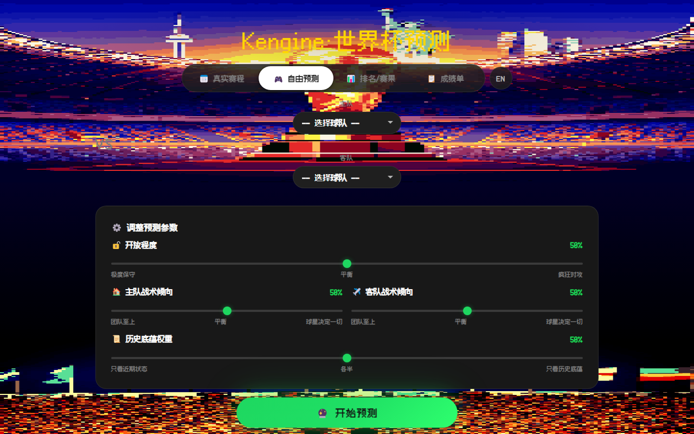
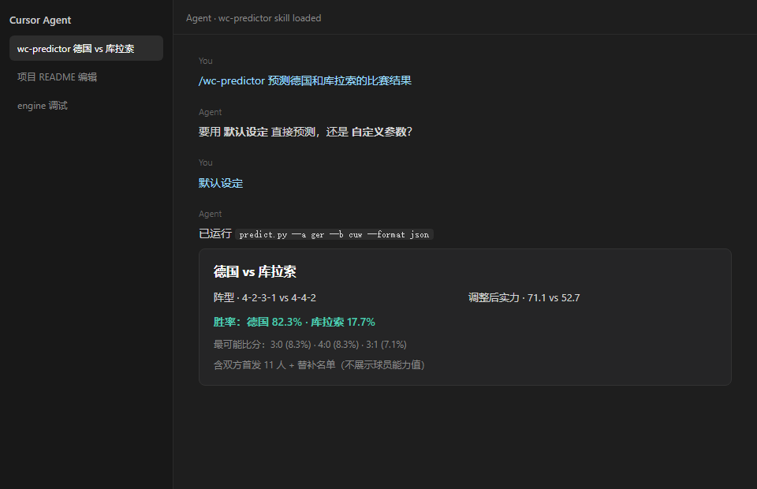
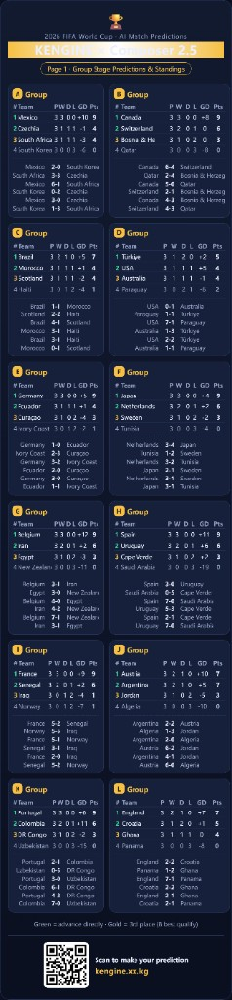
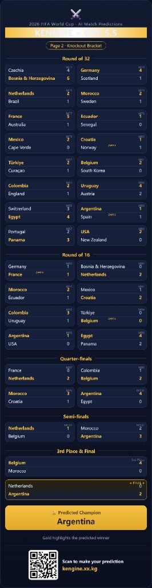
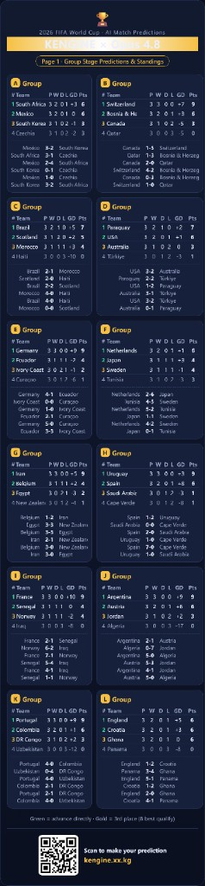
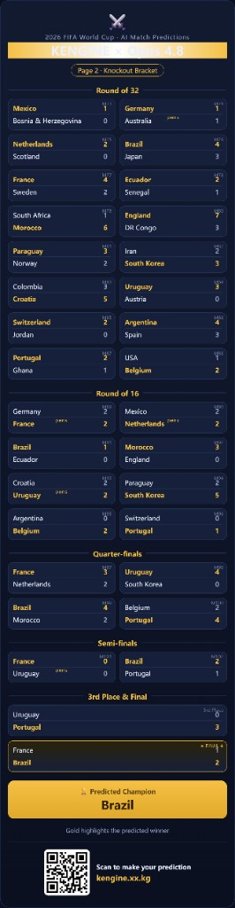

[中文](README.md) | **English**

> [!TIP]
> **Web app · No install · No signup · Play now**  
> **[kengine.xx.kg](https://kengine.xx.kg)**  
> China domain [www.kengine.fun](https://www.kengine.fun) — ICP filing in progress

# world-cup-predictor-skill

[](LICENSE)
[](#requirements)
[](https://cursor.com)
[](#1-install-the-skill)
[](https://kengine.xx.kg)

**world-cup-predictor-skill** packages the **Kengine** football simulation engine as a portable skill for the [Agent Skills standard](https://agentskills.io/specification)—ready for Cursor, Hermes Agent, Claude Code, Codex, and more. Name any two 2026 FIFA World Cup teams in chat and get **win probabilities, the three most likely scorelines, and full squads** (starters and bench).

The engine ships with **player ability ratings for all 48 squads**, plus structured team data distilled from **historical pedigree, recent form, and playing style**. You define the simulation—**formations, starting elevens, match openness, tactical tendencies, and heritage weight**—or accept defaults for a one-shot prediction. Kengine then runs a **deterministic numerical simulation**: identical inputs always yield identical outputs, never LLM guesswork.

## Preview

<table>
  <tr>
    <td width="50%" align="center"><strong>Web app · kengine.xx.kg</strong></td>
    <td width="50%" align="center"><strong>Agent · wc-predictor</strong></td>
  </tr>
  <tr>
    <td></td>
    <td></td>
  </tr>
</table>

---

## Requirements

- **Python 3.10+** (stdlib only, no third-party packages) — **required for all agents**
- Any agent that supports the [Agent Skills standard](https://agentskills.io/specification) (e.g. Cursor, Hermes, Claude Code)
- On Windows, set `PYTHONUTF8=1` if CLI output shows garbled Chinese

---

## 1. Install the Skill

Copy the **`wc-predictor/`** folder from this repo (`SKILL.md`, scripts, data) — not the entire `world-cup-predictor-skill` root. Other repo folders (`docs/`, `tools/`) are docs and maintenance scripts; **end users only need `wc-predictor/`**.

### Cursor

**Windows**

```powershell
New-Item -ItemType Directory -Force -Path "$env:USERPROFILE\.cursor\skills\wc-predictor"
robocopy "C:\path\to\world-cup-predictor-skill\wc-predictor" "$env:USERPROFILE\.cursor\skills\wc-predictor" /E
```

**macOS / Linux**

```bash
mkdir -p ~/.cursor/skills/wc-predictor
cp -r /path/to/world-cup-predictor-skill/wc-predictor/* ~/.cursor/skills/wc-predictor/
```

### Verify

```bash
python ~/.cursor/skills/wc-predictor/scripts/predict.py --list-teams
python ~/.cursor/skills/wc-predictor/scripts/predict.py --a ger --b cuw
```

If you see 48 teams and a prediction result, the install is OK.

### Load the Skill

After installing, **start a new Agent chat** (restart Cursor if needed) so `SKILL.md` is loaded.

---

## 2. Other agents

The same `wc-predictor/` folder works on Hermes, Claude Code, Codex, Gemini CLI, and others — **no format changes needed**.

| Agent | User-level path |
|-------|-----------------|
| **Cursor** | `~/.cursor/skills/wc-predictor/` |
| **Hermes Agent** | `~/.hermes/skills/wc-predictor/` |
| **Claude Code** | `~/.claude/skills/wc-predictor/` |
| **Codex / multi-agent** | `~/.agents/skills/wc-predictor/` |
| **Gemini CLI** | `~/.gemini/skills/wc-predictor/` |

**Hermes quick install:**

```bash
cp -r /path/to/world-cup-predictor-skill/wc-predictor ~/.hermes/skills/wc-predictor
hermes skills list   # confirm wc-predictor appears
```

**Verify (any agent — adjust the skill root path):**

```bash
python ~/.hermes/skills/wc-predictor/scripts/predict.py --list-teams
```

See **[docs/AGENTS.md](docs/AGENTS.md)** for full paths, GitHub install, and platform notes.

After install, **start a new agent session**. Trigger with `/wc-predictor` or natural language (e.g. “predict Germany vs Curaçao”).

---

## 3. Use the Skill

### In agent chat

**Chinese prompt example**

```
/wc-predictor 预测德国和库拉索的比赛结果
```

**English prompt example**

```
/wc-predictor predict Germany vs Curaçao, use default settings
```

**Custom parameters example**

```
/wc-predictor custom prediction Brazil vs Argentina: Brazil 4-2-3-1, Argentina 4-3-3, openness 70, heritage 60%, home tactical tendency 80%, away 50%, default lineups for both
```

**Let the Agent pick the parameters (fun mode)**

You don’t have to specify every slider yourself. In custom mode, you can tell the Agent to **choose all 8 parameter groups** — formations, lineups, openness, tendencies, heritage — based on its football read, then run the engine. Same inputs always yield the same numbers; compare results with friends and see **whose agent knows the game best**.

```
/wc-predictor custom Brazil vs Argentina — you pick every parameter, explain why, then predict
```

```
/wc-predictor 自定义预测巴西对阿根廷，所有参数你来定，定完解释理由再预测
```

### Agent-picked params · full tournament sims (example)

We let **Composer 2.5**, **GPT-5.5**, and **Opus 4.8** **choose match parameters themselves**, then ran the full **group stage + knockout** simulation through Kengine (2 images each, 6 total):

| Agent | Group stage | Knockout | Predicted champion |
|-------|-------------|----------|-------------------|
| Composer 2.5 |  |  | England |
| GPT-5.5 |  |  | Argentina |
| Opus 4.8 |  |  | Brazil |

> Looks like **picking the parameters yourself** might predict better… your turn — can you beat these agents? 😏

### Flow

1. **Mode gate (required)**  
   The Agent asks: **default settings** or **custom parameters**?  
   Unless you already said “default” or “custom” in the same message.

2. **Default**  
   Each team’s default formation + default 11 starters + openness 50 + tactical tendency 50% each + heritage weight 50%.

3. **Custom**  
   All 8 parameter groups must be settled before the CLI runs — either you specify each one, or you say “you pick everything” and let the Agent choose. See [`wc-predictor/references/parameters.md`](wc-predictor/references/parameters.md).

4. **Output**  
   After running `predict.py`, the Agent formats the reply with:
   - Formations, **team** adjusted strength, win rates, Top 3 scorelines, keywords
   - Both squads: 11 starters (with slots) + bench
   - **No player ability ratings** in the reply (ratings are engine-internal only)
   - No flag emoji
   - Chinese prompt → Chinese reply; English → English; any other language → English

### Local CLI (without Agent)

```bash
cd wc-predictor/scripts

python predict.py --list-teams
python predict.py --list-formations
python predict.py --team ger
python predict.py --a ger --b cuw
python predict.py --a ger --b cuw --format json
python predict.py --a ger --b cuw --format md --lang en

python predict.py --a bra --b arg \
  --formation-a "4-2-3-1" --formation-b "4-3-3" \
  --open 70 --heritage 0.6 --tendency-a 0.8 --tendency-b 0.5 \
  --format json
```

Team names accept id (`ger`), Chinese name, or English name. Invalid formations are rejected with the full list of 12 allowed formations.

---

## 4. How the engine works

Implementation: [`wc-predictor/scripts/engine.py`](wc-predictor/scripts/engine.py) (forked from the main `worldcup-predictor` Kengine).

### 4.1 Inputs

| Source | Content |
|--------|---------|
| `data/teams.json` | 48 World Cup teams: player ratings, positions, ages, default lineups, `heritage`, `playStyle`, etc. |
| User params | Formation (12 global options), 11 starters, openness, tactical tendency, heritage weight |

### 4.2 Per-team strength (computed separately for each side)

```
① Formation slot bonus
   Each starter rating × (1 + slot bonus for that formation)

② Position fit penalty
   Match between player positions and slot → 1.0 / 0.95 / 0.90 / 0.70

③ Tactical tendency (star weight)
   Top 3 players by rating get tier boosts (91+ / 86+ / 76+)
   Higher tendency → stars matter more; lower → more team-oriented

④ Heritage blend
   result = recent strength × (1 - heritage weight) + team heritage × heritage weight

⑤ Openness adjustment
   Tweaks strength using team playStyle and openness slider (0–100)
   Higher openness favors attacking teams; lower favors defensive styles
```

This yields **adjusted strength** `aFinal` and `bFinal`; `diff = aFinal - bFinal`.

### 4.3 Win rate

```
winRateA = sigmoid(diff, steepness=12)
winRateB = 1 - winRateA
```

Larger gaps push win rates toward 0% or 100%, but never exactly 0/100.

### 4.4 Score probabilities (Top 3)

1. Estimate expected total goals from **openness** (~1.5–7 goals)
2. Amplify goal gap from **strength difference**
3. Split total goals into Poisson λA / λB using win rate
4. Score all 0:0 … 9:9 combinations; keep Top 3 by probability

“Most likely scores” are the three highest-probability outcomes — **not** a single deterministic pick.

### 4.5 Keywords

Auto-generated from openness and strength gap, e.g. close match, dominant favorite, upset potential, open game, cagey game (Chinese labels in engine output).

### 4.6 Notes

- Same inputs → same outputs every time
- Agent must not bypass the CLI or invent players/scores
- Lineups must come from JSON `lineupA` / `lineupB`

---

## 5. More info

### Repository layout

```
world-cup-predictor-skill/
├── wc-predictor/              ← copy to ~/.cursor/skills/wc-predictor/
│   ├── SKILL.md
│   ├── scripts/               predict.py, engine.py, sync_data.py
│   ├── data/teams.json
│   └── references/
├── tools/
│   └── fix_player_name_en.py
└── docs/                      AGENTS / README screenshots
```

### Sync team data

```bash
python wc-predictor/scripts/sync_data.py --source "C:/path/to/worldcup-predictor"
python tools/fix_player_name_en.py   # re-apply known English name patches if needed
```

### Redeploy after changes

Edit `wc-predictor/` in this repo, copy again to `~/.cursor/skills/wc-predictor/`, then open a new Agent chat.

### Out of scope

- Web UI, share cards, deployment scripts (use [kengine.xx.kg](https://kengine.xx.kg) for the web app)
- Post-prediction verbal tweaks (no Layer 2)
- Remote API — all computation runs locally via Python

### Related docs

- [docs/AGENTS.md](docs/AGENTS.md) — install on Cursor, Hermes, Claude Code, Codex, etc.
- [wc-predictor/references/parameters.md](wc-predictor/references/parameters.md)
- [wc-predictor/references/formations.md](wc-predictor/references/formations.md)
- [wc-predictor/references/teams.md](wc-predictor/references/teams.md)

### License

MIT
